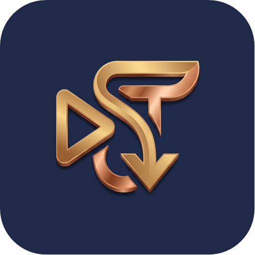

# SaveTek

**حمّل فيديوهاتك بأعلى جودة — Download your videos in the highest quality**

[العربية](#العربية) · [English](#english)

---

## العربية

**SaveTek** تطبيق أندرويد مجاني ومفتوح المصدر لحفظ الفيديوهات والصوت بأعلى جودة متاحة: الصق الرابط (أو شاركه من أي تطبيق)، اختر الجودة، واحفظ الملف في معرض جوالك.

### الميزات
- **جودة حتى 4K** مع عرض حجم كل جودة قبل التحميل.
- **صوت MP3** بضغطة واحدة.
- **التحميل في الخلفية** مع إشعار وشريط تقدّم، حتى والشاشة مطفأة.
- **مشغّل داخلي** للفيديو والصوت: تقديم وترجيع بالنقر المزدوج، ملء الشاشة، والتحكم بالصوت.
- **تحويل أي فيديو إلى MP3** بجودة 128 أو 192 أو 320 kbps، والأصل يبقى كما هو.
- **8 لغات**: العربية، الإنجليزية، الأردية، التركية، الفرنسية، الإسبانية، الإندونيسية، الهندية.
- **4 مظاهر**: كحلي وذهبي، فاتح، داكن (AMOLED)، أو حسب الجهاز.
- **تحديث تلقائي** لمحرك التحميل وللتطبيق، مع التحقق من بصمة SHA-256 والتوقيع قبل التثبيت.
- **خصوصية تامة**: لا حسابات، ولا إعلانات، ولا أدوات تتبع.

### طريقة التثبيت
1. حمّل آخر إصدار من صفحة **[Releases](../../releases/latest)** (الملف `arm64-v8a` يناسب أغلب الجوالات الحديثة، و`armeabi-v7a` للجوالات القديمة 32-bit، و`universal` يعمل على الجميع).
2. افتح الملف من إشعار التحميل أو من تطبيق "الملفات".
3. عند طلب أندرويد: اضغط "الإعدادات" وفعّل **"السماح من هذا المصدر"**، ثم ارجع.
4. اضغط "تثبيت" ثم "فتح".

يتطلب أندرويد 7.0 فما فوق. بعد التثبيت الأول، يحدّث التطبيق نفسه من داخله.

### ⚠️ تنبيه الاستخدام المسؤول
SaveTek أداة لحفظ المحتوى الذي تملكه أو المسموح لك بتحميله فقط. المستخدم وحده مسؤول عن المحتوى الذي يحمّله، وعليه احترام حقوق أصحابه، والقوانين المعمول بها، وشروط استخدام المواقع. راجع [شروط الاستخدام](docs/terms.html) و[سياسة الخصوصية](docs/privacy.html).

### الترخيص
الكود المصدري مرخّص بترخيص **GNU GPL-3.0** — انظر ملف [LICENSE](LICENSE).

**اسم SaveTek وشعاره غير مشمولين بترخيص الكود**، ولا يجوز استخدامهما في نسخ معدّلة أو منتجات أخرى دون إذن.

### تواصل معنا
[savetek.app@gmail.com](mailto:savetek.app@gmail.com)

---

## English

**SaveTek** is a free, open-source Android app for saving videos and audio in the best available quality: paste a link (or share it from any app), pick the quality, and save the file to your phone's gallery.

### Features
- **Up to 4K quality**, with each option's size shown before downloading.
- **MP3 audio** with one tap.
- **Background downloads** with a progress notification, even with the screen off.
- **Built-in player** for video and audio: double-tap seeking, full screen and volume control.
- **Convert any video to MP3** at 128, 192 or 320 kbps — the original stays untouched.
- **8 languages**: Arabic, English, Urdu, Turkish, French, Spanish, Indonesian, Hindi.
- **4 themes**: navy & gold, light, AMOLED dark, or follow the device.
- **Automatic updates** for the download engine and the app, with SHA-256 and signature verification before installing.
- **Privacy first**: no accounts, no ads, no trackers.

### How to install
1. Download the latest version from the **[Releases](../../releases/latest)** page (`arm64-v8a` fits most modern phones, `armeabi-v7a` is for older 32-bit phones, `universal` works everywhere).
2. Open the file from the download notification or your Files app.
3. When Android asks, tap Settings and turn on **"Allow from this source"**, then go back.
4. Tap Install, then Open.

Requires Android 7.0 or later. After the first install, the app updates itself.

### ⚠️ Responsible use
SaveTek is a tool for saving content you own or are allowed to download. Users alone are responsible for the content they download and must respect the rights of its owners, applicable laws, and the websites' terms of use. See the [Terms of use](docs/terms.html) and [Privacy policy](docs/privacy.html).

### License
The source code is licensed under the **GNU GPL-3.0** — see [LICENSE](LICENSE).

**The SaveTek name and logo are not covered by the code license** and may not be used in modified versions or other products without permission.

### Third-party components
SaveTek is built on open-source projects, each under its own license:
[yt-dlp](https://github.com/yt-dlp/yt-dlp) (Unlicense) ·
[FFmpeg](https://ffmpeg.org/legal.html) (LGPL/GPL) ·
[youtubedl-android](https://github.com/JunkFood02/youtubedl-android) (GPL-3.0) ·
[AndroidX & Jetpack Compose](https://developer.android.com/jetpack/androidx) (Apache-2.0) ·
[Media3](https://github.com/androidx/media) (Apache-2.0) ·
[Coil](https://github.com/coil-kt/coil) (Apache-2.0).

### Building from source
1. Open the project in Android Studio (JDK 17+).
2. Set your GitHub username in `app/src/main/java/com/nazeeltek/savetek/AppConfig.kt`.
3. Release signing keys are **never** stored in this repository. Create your own keystore and point Gradle to a `keystore.properties` file outside the project (see the top of `app/build.gradle.kts`).
4. Build: `gradlew assembleRelease` — or run `tools/make-release.ps1` to build, collect the APKs and regenerate `docs/version.json`.

### Contact
[savetek.app@gmail.com](mailto:savetek.app@gmail.com)
